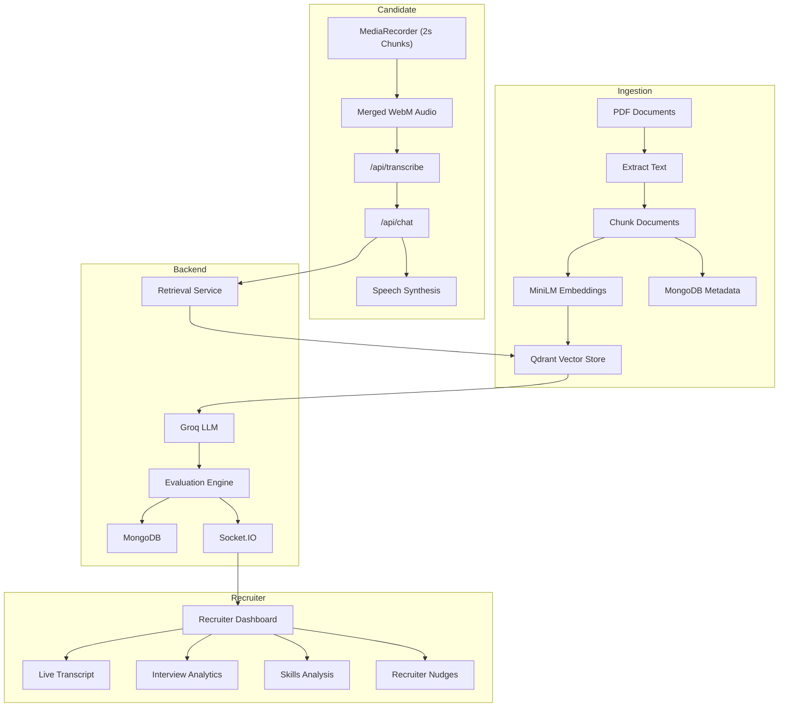

# AI Voice Recruiter & Live Evaluation Platform

An end-to-end AI-powered recruitment platform that conducts voice-based technical interviews, grounds questions and answers in a custom knowledge base via Retrieval-Augmented Generation (RAG), and streams real-time candidate evaluation metrics to a live recruiter dashboard.

## Features

- **Voice-Based Interactive Interview**: Real-time microphone capture with browser SpeechSynthesis audio playback for an interactive conversational flow.
- **Single-Upload Audio STT**: Buffers 2-second audio chunks locally in memory and merges them into a single WebM file upon answer completion, sending exactly ONE transcription request to Groq Whisper (`whisper-large-v3`) per turn.
- **Knowledge-Grounded RAG**: Ingests job descriptions, guidelines, and candidate resumes, generates 384-dimensional vector embeddings locally using `@xenova/transformers`, and retrieves context via Qdrant vector search.
- **Grounded LLM Question & Answer Generation**: Generates contextual interview questions and grounded candidate assistance using Groq (`llama-3.3-70b-versatile`).
- **Automated Interview Evaluation Engine**: Evaluates technical depth, communication, and confidence scores after every answer, detecting covered vs. missing skills and generating live recruiter nudges.
- **Live Recruiter Dashboard**: Multi-room Socket.IO synchronization streaming live candidate transcripts, session timeline, status indicators, score breakdowns, skill coverage, and follow-up probes.

## Tech Stack

- **Frontend**: React 19, Vite, Tailwind CSS v4, Socket.IO Client, Axios, Web Speech API (`SpeechSynthesis`, `MediaRecorder`).
- **Backend**: Node.js, Express 5, Socket.IO, Multer, `pdf-parse`, `fluent-ffmpeg`, `ffmpeg-static`.
- **AI & ML Pipeline**:
  - **Speech-to-Text**: Groq Whisper (`whisper-large-v3`).
  - **LLM / RAG**: Groq API (`llama-3.3-70b-versatile`, fallback `llama3-8b-8192`).
  - **Local Embeddings**: `@xenova/transformers` (`sentence-transformers/paraphrase-multilingual-MiniLM-L12-v2`, 384 dimensions).
- **Databases**:
  - **Vector Database**: Qdrant Cloud (`candidate_kb` collection, Cosine metric).
  - **Document Database**: MongoDB Atlas (`Conversation`, `KnowledgeDocument`, `InterviewAnalytics`, `RecruiterNudge`).

## Environment Variables

An `.env.example` file is included with all the required environment variables.

Create your local `.env` file by copying it:

```bash
cp .env.example .env
```

## Installation & Setup

### Prerequisites

- Node.js 18+
- MongoDB instance (local or Atlas)
- Qdrant Cloud cluster or local instance
- Groq API Key

### Backend Setup

```bash
cd server
npm install
npm run dev
```

The server will start on `http://localhost:5000`.

### Frontend Setup

```bash
cd client
npm install
npm run dev
```

The application will be accessible at `http://localhost:5173`.

## Application Routes

### Frontend Pages

- `/`: Candidate Voice Interview interface.
- `/dashboard`: Live Recruiter Dashboard for monitoring candidate sessions.

### Backend API Endpoints

- `POST /api/transcribe`: Accepts audio file upload (`audio`), converts non-WAV formats to PCM WAV via `ffmpeg`, transcribes using Groq Whisper, and cleans up temp files.
- `POST /api/chat`: Accepts `{ query, sessionId }`, retrieves top-K context chunks from Qdrant, generates LLM response via Groq, executes evaluation engine, persists metrics to MongoDB, and broadcasts updates over Socket.IO.
- `POST /api/upload`: Uploads PDF documents to server `uploads/` folder.
- `POST /api/retrieve`: Tests vector search in Qdrant for a given text query.
- `GET /api/test-chunks`: Tests PDF parsing and 300-word text chunking.
- `GET /api/test-embeddings`: Tests local MiniLM embedding generation.
- `GET /api/test-ingestion`: Executes end-to-end ingestion pipeline (Extract → Chunk → Embed → Qdrant + MongoDB).
- `GET /health`: System health check returning status of MongoDB, Qdrant, Groq, and Socket.IO.

## Knowledge Base Ingestion Flow

1. **Extraction**: `pdfService` extracts raw text from PDF files located in `server/uploads/` using `pdf-parse`.
2. **Chunking**: `chunkService` cleans whitespace and splits document text into chunks of up to 300 words, appending source metadata and UUID chunk IDs.
3. **Embedding Generation**: `embeddingService` uses `@xenova/transformers` running the `sentence-transformers/paraphrase-multilingual-MiniLM-L12-v2` model locally to generate 384-dimensional dense vectors without external API calls.
4. **Vector & Metadata Storage**:
   - `qdrantService` upserts the 384-dim vectors along with payload (`source`, `content`, `wordCount`) into Qdrant (`candidate_kb` collection).
   - `mongoService` performs bulk upserts to save document metadata (`chunkId`, `source`, `wordCount`, `ingestionStatus`) in MongoDB (`KnowledgeDocument` schema).

## Runtime Interview Flow

1. **Audio Recording**: In `Interview.jsx`, `useRecorder` captures candidate speech via `MediaRecorder` in 2-second interval chunks, buffering them in memory (`chunksRef`).
2. **Audio Merging & Transcription**: When recording stops, all recorded chunks are merged into a single WebM Blob. Exactly **ONE merged audio file** per answer is uploaded to `POST /api/transcribe`.
3. **Audio Conversion & Whisper STT**: The backend receives the file, uses `fluent-ffmpeg` to convert it to PCM 16-bit WAV format, sends it to Groq Whisper (`whisper-large-v3`), and returns the transcript.
4. **Context Retrieval**: `chatController` generates a 384-dim query embedding using `@xenova/transformers` and queries Qdrant for top 5 matching context chunks.
5. **Grounded Answer Generation**: Groq LLM (`llama-3.3-70b-versatile`) synthesizes an interview response conditioned strictly on retrieved context and recent conversation history.
6. **Interview Evaluation Engine**: `evaluationService` extracts candidate response features, cross-references required job skills (`server/config/jobDescription.json`), computes numerical scores (Overall, Technical, Communication, Confidence), identifies detected/missing skills, and builds follow-up probes.
7. **Database Persistence & Socket Broadcast**: Evaluation results are saved in MongoDB (`InterviewAnalytics` and `RecruiterNudge` models) and emitted over Socket.IO to room `sessionId` under event `interview:update` (`analytics`, `skills`, `nudges`).
8. **UI Update**: Recruiter Dashboard updates live metrics in real-time while browser `SpeechSynthesis` reads the AI response to the candidate.

## Architecture Overview



Recruiters can monitor live interviews from /dashboard using the active sessionId, where transcripts, analytics, skills, recruiter nudges, and hiring recommendations are updated in real time.

## Screenshots


_Candidate Voice Interview Interface (`/`)_


_Recruiter Monitoring Dashboard (`/dashboard`)_

## Future Improvements

1. Add multilingual support (Filipino/Taglish and Bahasa Indonesia) with localized prompts, TTS, and evaluation.
2. Support automatic resume upload and create candidate-specific knowledge bases in Qdrant.
3. Improve interview evaluation with more detailed technical and behavioral scoring using LLMs.
4. Replace REST audio uploads with real-time WebSocket audio streaming for lower latency.
5. Add authentication, interview history, and downloadable interview reports.
