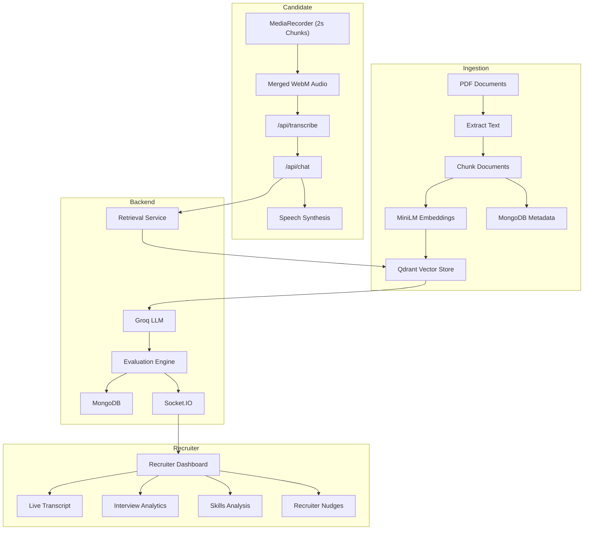

# AI Voice Recruiter & Live Evaluation Platform

An end-to-end AI-powered recruitment platform that conducts voice-based technical interviews, grounds questions and answers in a custom knowledge base via Retrieval-Augmented Generation (RAG), and streams real-time candidate evaluation metrics to a live recruiter dashboard.

## Features

🎤 Voice-based interview with Groq Whisper
🧠 RAG-powered question answering using Qdrant
📄 PDF knowledge base ingestion with local embeddings
📊 Real-time recruiter dashboard using Socket.IO
📈 Automated interview evaluation and scoring
🎯 Skill detection, recruiter nudges, and hiring recommendation
💾 MongoDB for conversation history and analytics

## Tech Stack

- **Frontend**: React 19, Vite, Tailwind CSS v4, Socket.IO Client, Axios, Web Speech API (`SpeechSynthesis`, `MediaRecorder`).
- **Backend**: Node.js, Express 5, Socket.IO, Multer, `pdf-parse`, `fluent-ffmpeg`, `ffmpeg-static`.
- **AI & ML Pipeline**:
  - **Speech-to-Text**: Groq Whisper (`whisper-large-v3`).
  - **LLM / RAG**: Groq API (`llama-3.3-70b-versatile`, fallback `llama3-8b-8192`).
  - **Local Embeddings**: `@xenova/transformers` (`sentence-transformers/paraphrase-multilingual-MiniLM-L12-v2`, 384 dimensions).
- **Databases**:
  - **Vector Database**: Qdrant Cloud (`candidate_kb` collection, Cosine metric).
  - **Document Database**: MongoDB Atlas (`Conversation`, `KnowledgeDocument`, `InterviewAnalytics`, `RecruiterNudge`).

## Environment Variables

An `.env.example` file is included with all the required environment variables.

Create your local `.env` file by copying it:

```bash
cp .env.example .env
```

## Installation & Setup

### Prerequisites

- Node.js 18+
- MongoDB instance (local or Atlas)
- Qdrant Cloud cluster or local instance
- Groq API Key

### Backend Setup

```bash
cd server
npm install
npm run dev
```

The server will start on `http://localhost:5000`.

### Frontend Setup

```bash
cd client
npm install
npm run dev
```

The application will be accessible at `http://localhost:5173`.

## 📍 Application Routes

### Frontend

- **`/`** – Candidate Voice Interview
- **`/dashboard`** – Live Recruiter Dashboard

### Backend APIs

| Endpoint               | Description                                       |
| ---------------------- | ------------------------------------------------- |
| `POST /api/transcribe` | Transcribe candidate audio using Groq Whisper     |
| `POST /api/chat`       | RAG-based interview, evaluation, and live updates |
| `POST /api/upload`     | Upload PDF knowledge base documents               |
| `POST /api/retrieve`   | Test semantic retrieval                           |
| `GET /health`          | Health check                                      |

---

## 📚 Knowledge Base Pipeline

1. Extract text from uploaded PDFs.
2. Split documents into semantic chunks.
3. Generate MiniLM embeddings locally.
4. Store vectors in **Qdrant** and metadata in **MongoDB**.
5. Retrieve relevant chunks during interviews to ground LLM responses.

---

## 🎤 Interview Flow

1. Record the candidate's answer.
2. Merge audio and transcribe it using **Groq Whisper**.
3. Retrieve relevant context from **Qdrant**.
4. Generate the next interview response with **Groq LLM**.
5. Evaluate the response (scores, skills, recruiter nudges).
6. Store analytics in **MongoDB** and stream live updates to the recruiter dashboard via **Socket.IO**.

## Architecture Overview



Recruiters can monitor live interviews from /dashboard using the active sessionId, where transcripts, analytics, skills, recruiter nudges, and hiring recommendations are updated in real time.

## Screenshots


_Candidate Voice Interview Interface (`/`)_


_Recruiter Monitoring Dashboard (`/dashboard`)_

## Future Improvements

1. Add multilingual support (Filipino/Taglish and Bahasa Indonesia) with localized prompts, TTS, and evaluation.
2. Support automatic resume upload and create candidate-specific knowledge bases in Qdrant.
3. Improve interview evaluation with more detailed technical and behavioral scoring using LLMs.
4. Replace REST audio uploads with real-time WebSocket audio streaming for lower latency.
5. Add authentication, interview history, and downloadable interview reports.
